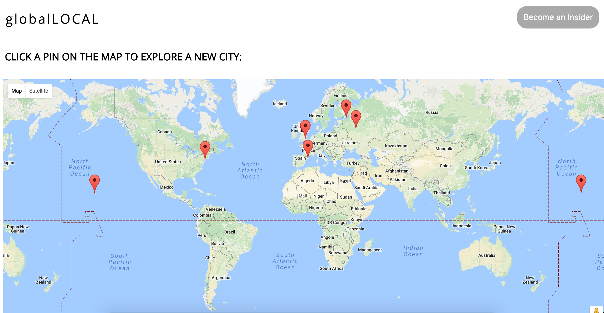
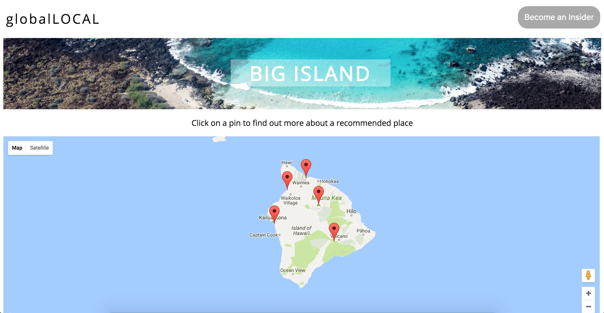
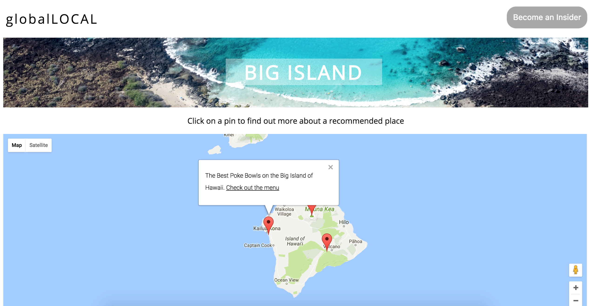

# globalLocal:

globalLocal is a currated travel app, that helps you to find recommended places to see/visit around the world . Implemented using **JavaScript**, **React**, **Node.js Express Framework**, **HTML** & **CSS**, **GoogleMaps API**.

# How to use the app:

- In order to use the app, click on the "Get Started" button.

- You'll see a global map, click on one of the pins on the map of the city you would like to visit.

- Once you are on the city page, you can click on pins on the map to read more about the recommended place to visit.

- You can sign up for updates by clicking the button "Become an Insider" in the top right corner.

